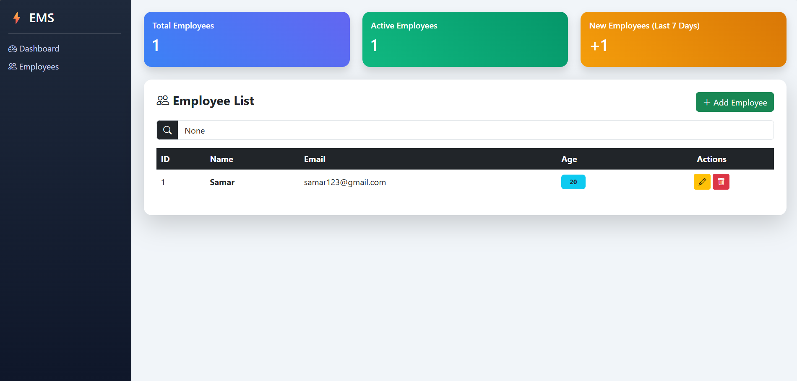
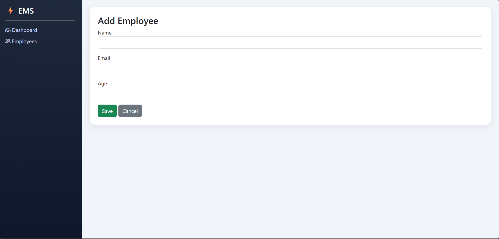

# 💼 Employee Management System


---

## 📌 Overview

A modern Employee Management System built using Django that allows users to manage employee records efficiently.

---

## ✨ Features

* Add, Update, Delete Employees (CRUD)
* Search Employees
* Dashboard with Employee Statistics
* Track New Employees (Last 7 Days)
* Responsive UI

---

## 🛠️ Tech Stack

* Python
* Django
* HTML/CSS
* Bootstrap
* SQLite

---

## ⚙️ Setup

```bash
pip install django
python manage.py makemigrations
python manage.py migrate
python manage.py runserver
```

---

## 📸 Screenshots

## 📸 Screenshots



---

## 🚀 Future Improvements

* Login system
* Charts dashboard
* Dark mode

---

## 👨‍💻 Author

Samarth Gujar
