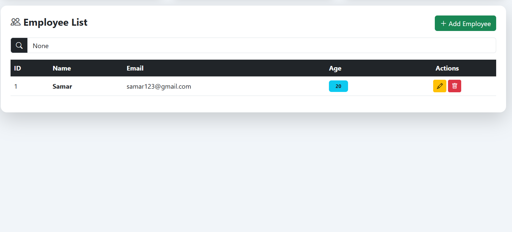

# 💼 Employee Management System


---

## 📌 Overview

A modern **Employee Management System** built using Django that allows users to efficiently manage employee records.
It features a clean dashboard UI, search functionality, and real-time employee statistics.

---

## ✨ Features

* ➕ Add, Update, Delete Employees (CRUD)
* 🔍 Search Employees
* 📊 Dashboard with Employee Statistics
* 📅 Track New Employees (Last 7 Days)
* 🎨 Modern UI with Bootstrap
* 📱 Fully Responsive Design
* 📢 Success & Error Messages

---

## 🛠️ Tech Stack

| Technology | Description          |
| ---------- | -------------------- |
| Python     | Programming Language |
| Django     | Backend Framework    |
| HTML/CSS   | Frontend             |
| Bootstrap  | UI Styling           |
| SQLite     | Database             |

---

## 📂 Project Structure

```
myapp/
│── models.py
│── views.py
│── urls.py
│
└── templates/
    │── base.html
    │── employee_list.html
    │── employee_form.html
    │── employee_confirm_delete.html
```

---

## ⚙️ Installation & Setup

### 1️⃣ Clone Repository

```
git clone https://github.com/your-username/your-repo-name.git
cd your-repo-name
```

### 2️⃣ Install Dependencies

```
pip install django
```

### 3️⃣ Run Migrations

```
python manage.py makemigrations
python manage.py migrate
```

### 4️⃣ Start Server

```
python manage.py runserver
```

---

## 📸 Screenshots

### 🏠 Dashboard View


> Overview of employee statistics and system interface




---

### 👥 Employee Management

> View, edit, and delete employee records


---

### ➕ Add Employee

> Clean and simple form to add employees


---

## 🚀 Future Enhancements

* 🔐 User Authentication (Login/Register)
* 📊 Charts Dashboard
* 🌙 Dark Mode
* 🌐 REST API Integration

---

## 🙌 Contribution

Contributions are welcome! Feel free to fork this repository and improve it.

---

## 👨‍💻 Author

Developed by **Samarth Gujar**

---

## ⭐ Support

If you like this project, give it a ⭐ on GitHub!
